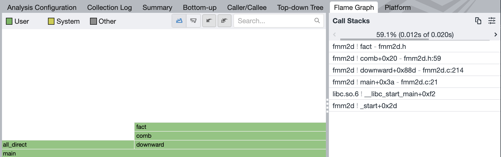
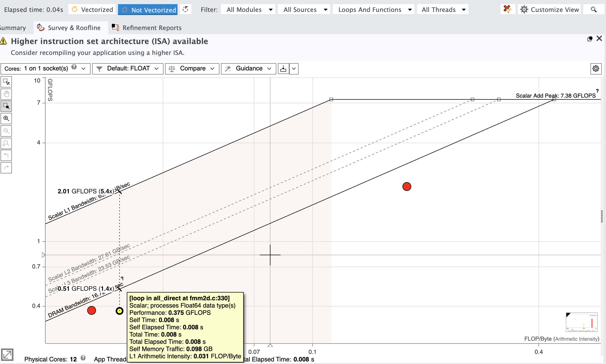
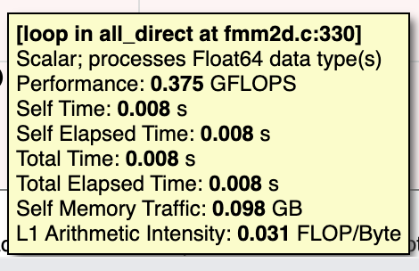

# Advanced Performance Profiling
CSCI 653: High Performance Computing and Simulations (Fall 2022)

## Resources
Profiling and analysis for homework 6 requires an Intel DevCloud account. To set up an account with DevCloud  [use](https://software.intel.com/devcloud/oneapi) this link to sign up or register. Even if you previously made a DevCloud account, the above link can be used to revive an expired account.

For help with logging into the nodes please refer to the [documentation](https://devcloud.intel.com/oneapi/documentation/connect-with-ssh-linux-macos/) under OneApi for DevCloud.

## Pre-requisite: Installing the profiler and analysis GUI
+ Download & install the latest version of the Intel oneAPI Vtune Profiler GUI from [here](https://www.intel.com/content/www/us/en/developer/tools/oneapi/vtune-profiler-download.html).

+ Download & install the latest version of the Intel oneAPI Advisor GUI from [here](https://www.intel.com/content/www/us/en/developer/articles/tool/oneapi-standalone-components.html#advisor)

Upon installation, launch the GUI. Depending on your OS, the default installation path would be.
- windows: C:\Program Files (x86)\Intel\oneAPI\
- Linux OS: /opt/intel/oneapi/
- mac OS: /opt/intel/oneapi/

## Profiling FMM with VTune

By now you are well familar with "a fast algorithm for particle simulations" [Journal of Computational Physics 73,  325–
348 (1987)] that was introduced in assignment 2. 

Bear in mind that VTune is capable of generating several analysis reports for a target application.

They are:
+ performance-snapshot
+ hotspot analysis
+ anomaly-detection
+ memory-consumption
+ micro-architecture exploration
+ memory-access
+ hpc-performance
+ i/o
+ gpu-offload
+ gpu-hotpost
+ fpga-interactoin
+ system-overview
+ platform-profiler

For this part, we will carry out a hotspot analysis to identify the critical aspects of our program from the profile report which we will learn to generate.

Clone this reposotory to your devcloud account
```
git clone https://github.com/TaufeqRazakh/AdvancedPerformanceProfiling.git
```
Compile the analysis target (program) using the intel oneAPI compiler. We will be using the icx compiler driver since we care compiling. a C program. 
```
cd fmm_profiling
icx -g fmm2d.c -o fmm2d
```
Request a compute node
```
qsub -I
```
Now run the hotspot analysis
```
vtune --collect hotspots --result-dir rFMMHotspots ./fmm2d
```
When the profiler finishes the collection step you should see a message which lists the hotpots to the command line
```
Top Hotspots
Function    Module  CPU Time  % of CPU Time(%)
----------  ------  --------  ----------------
all_direct  fmm2d     0.020s             50.5%
fact        fmm2d     0.012s             29.4%
cmul        fmm2d     0.008s             20.1%
```
A detailed report is also generated whose name was specied when we entered  our vtune collection command as `rFMMHotspots`. We can now import this generated file  to our local computer and inspect the result file (*vtune) with the VTune proiler GUI.
A simple way to import this would be through sftp
```
sftp devcloud
cd AdvancedPerformanceProfiling/fmm_profiling
get -r rFMMHotspots
bye
```

Once you have completed importing the results, click on the three lines displayed on the left bar of the VTune window and select open>Result>\<*vtune report>.

Let's view the flame graph to view the call stack for the main function.


## Identifying paralelizing opportunities in FMM with Advisor
Identifying parallelizing opportunities in loops is best left to Advisor. Run an quick advisor collection with the following command.
```
advisor advisor --collect=roofline --project-dir=eFMMRoofline -- ./fmm2d
```
Import the results to your local machine with the commands 
```
sftp devcloud
cd AdvancedPerformanceProfiling/fmm_profiling
get -r eFMMRoofline
bye
```
Open the Advisor GUI and select open project.
Then select the `*.advixeproj` from the imported result directory. 

You should be able to see the loops in the fmm program sitting on the roofline plots uping completion

> Do you see any opportunity here?

